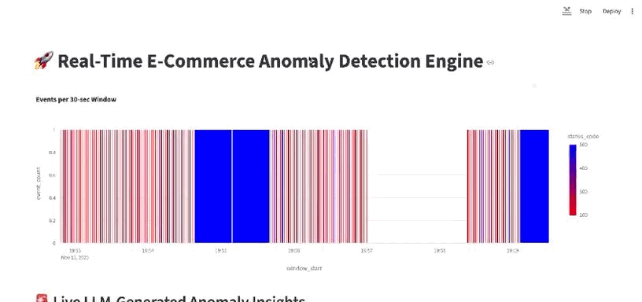

# 🚀 Real-Time Anomaly Detection & Insights Engine

This project is a complete, end-to-end data engineering and MLOps system that simulates, processes, and analyzes a real-time stream of e-commerce logs.

It's not just an alerting system; it's an **insights engine**. When an anomaly (like a spike in payment errors) is detected, the system automatically triggers a local **LLM (Llama 3)**, which uses **Retrieval-Augmented Generation (RAG)** to analyze the raw logs, consult a knowledge base, and provide a plain-English **root cause analysis**—all in real-time.

-----

## 🎥 Live Demo



-----

## 🏛️ System Architecture

The project implements a modern "speed layer" architecture, handling data from initial ingestion to final insight.

The data flows as follows:

1.  **Producer (`run_producer.py`):** A Python script simulates e-commerce log events (clicks, errors) and pushes them into a **Kafka** topic.
2.  **Stream Processor (`run_processor.py`):** A **Spark Streaming** job subscribes to the Kafka topic.
3.  **Real-Time ETL:** For *every* micro-batch, Spark:
    a. **Calculates Metrics** (e.g., event counts) and saves them to a **TimescaleDB** hypertable.
    b. **Detects Anomalies** (e.g., error rate \> 20%).
4.  **RAG & Insight Generation:** If an anomaly is found:
    a. The raw error logs are sent to the **LLM Analyzer** (LangChain).
    b. The analyzer queries a **pgvector** database (RAG) to find similar historical incidents from the `runbook.md` knowledge base.
    c. A local **Ollama (Llama 3)** model receives the logs + context and generates a root cause analysis.
    d. The analysis is saved to a `llm_alerts` table in Postgres.
5.  **Dashboard (`run_dashboard.py`):** A **Streamlit** dashboard queries the TimescaleDB and `llm_alerts` tables to display live metrics and AI-generated insights.

-----

## ✨ Key Features

  * **Real-Time Data Pipeline:** Ingests and processes data with sub-minute latency using **Kafka** and **Spark Streaming**.
  * **Time-Series Monitoring:** Uses **TimescaleDB** to efficiently store and query time-series metrics for the live dashboard.
  * **LLM-Powered Root Cause Analysis:** Goes beyond simple alerts. When an anomaly is detected, it uses a local **Ollama** model and **LangChain** to explain *why* it's happening.
  * **RAG Knowledge Base:** The LLM's analysis is grounded by a **pgvector** vector database, allowing it to reference historical incidents and documentation for high-quality insights.
  * **Configurable & Structured:** The project is built as a professional Python package. All settings (hostnames, topic names, model names) are managed in a single `.env` file, with no hardcoded values.
  * **Modern Dependency Management:** Uses **`uv`** and a `pyproject.toml` file for rapid, deterministic environment setup.

-----

## 🛠️ Tech Stack

| Category | Technology | Purpose |
| :--- | :--- | :--- |
| **Orchestration** | **Docker & Docker Compose** | Runs all infrastructure (Kafka, Postgres) in containers. |
| **Dependency Mgmt** | **`uv`** | For creating the virtual environment and installing packages. |
| **Streaming** | **Apache Kafka** | The real-time message bus for log ingestion. |
| | **Apache Spark Streaming** | For real-time data processing, aggregation, and analysis. |
| **Database** | **PostgreSQL** | The core relational database. |
| | **TimescaleDB (extension)** | For efficient time-series metrics storage. |
| | **pgvector (extension)** | For storing vector embeddings for the RAG system. |
| **LLM & RAG** | **Ollama (Llama 3)** | Provides the local, free, open-source LLM. |
| | **LangChain** | The framework used to build the RAG "chain" and prompt the LLM. |
| **Frontend** | **Streamlit** | To build the interactive, real-time web dashboard. |
| | **Plotly** | For rendering the live metrics charts. |
| **Core Language** | **Python 3.10+** | |

-----

## 🏁 How to Run

Follow these steps to get the entire application running locally.

### Prerequisites

1.  **Clone the repository:** `git clone ...`
2.  **Docker Desktop:** Must be installed and **running**.
3.  **`uv`:** Must be installed.
4.  **Ollama:** Must be installed and the `llama3` model pulled:
    ```bash
    ollama pull llama3
    ```
5.  **Spark JARs:** Ensure the `jars/` folder contains your Kafka and PostgreSQL JDBC drivers.

### Launch Checklist

1.  **Setup Environment (Run Once):**
    Open a terminal in the project root.

    ```bash
    # Create the virtual environment
    uv venv

    # Activate the environment
    # macOS/Linux:
    source .venv/bin/activate
    # Windows (PowerShell):
    # .\.venv\Scripts\Activate.ps1

    # Install all dependencies
    uv pip sync
    ```

2.  **Start Infrastructure (Terminal 1):**
    This command starts Kafka and PostgreSQL in the background.

    ```bash
    docker-compose up -d
    ```

    (Wait 30-60 seconds for the containers to initialize).

3.  **Setup Database (Run Once):**
    This script enables `pgvector` and populates the RAG knowledge base from `data/runbook.md`.

    ```bash
    python scripts/setup_rag.py
    ```

4.  **Run the Application (3 Terminals):**
    You need three separate terminals, all with the `.venv` activated.

      * **Terminal A (Producer):**

        ```bash
        python run_producer.py
        ```

      * **Terminal B (Processor):**

        ```bash
        python run_processor.py
        ```

      * **Terminal C (Dashboard):**

        ```bash
        streamlit run run_dashboard.py
        ```

5.  **See the Magic\!**

      * Open the Streamlit URL (e.g., `http://localhost:8501`) in your browser.
      * Watch the "Live Event Metrics" chart.
      * Wait 1-2 minutes for the producer to simulate an anomaly.
      * You will see **red bars** appear on the chart and a **new alert** will pop up below with the LLM's root cause analysis.

-----

## 📂 Project Structure

```
realtime_anomaly_engine/
│
├── .env                  # All project configuration
├── .gitignore
├── docker-compose.yml    # Defines Kafka, Zookeeper, and Postgres services
├── pyproject.toml        # Defines project dependencies for uv
├── README.md             # You are here!
│
├── data/
│   └── runbook.md        # The RAG knowledge base
│
├── jars/
│   └── ... (Spark JDBC drivers)
│
├── scripts/
│   └── setup_rag.py      # One-time script to populate the vector DB
│
├── anomaly_engine/       # The core Python package
│   ├── config.py         # Loads and provides all settings from .env
│   ├── database.py       # Manages all DB connections and RAG setup
│   ├── llm_analyzer.py   # Contains the LangChain RAG logic
│   └── streaming.py      # Contains the Spark streaming/analysis logic
│
├── run_dashboard.py      # Entry point for the Streamlit app
├── run_producer.py       # Entry point for the Kafka producer
└── run_processor.py      # Entry point for the Spark processor
```

-----

## 💡 Future Improvements

  * **Batch Layer:** Add an **Apache Airflow** DAG to perform batch jobs, such as automatically scraping new incidents for the RAG knowledge base or retraining the anomaly model.
  * **ML Anomaly Detection:** Replace the simple rule-based anomaly detection (`error_rate > 20%`) with a proper machine learning model (e.g., Isolation Forest or an Autoencoder) trained on historical data.
  * **Deployment:** Containerize the Python applications (`producer`, `processor`, `dashboard`) and deploy the entire stack to a Kubernetes (K8s) cluster on a cloud provider.
